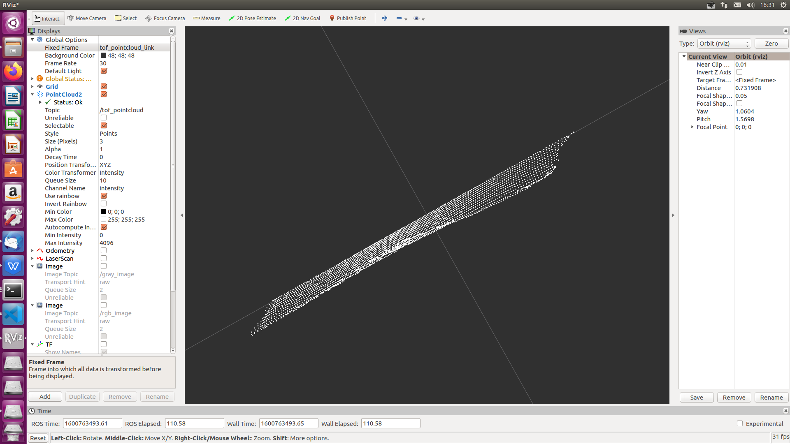
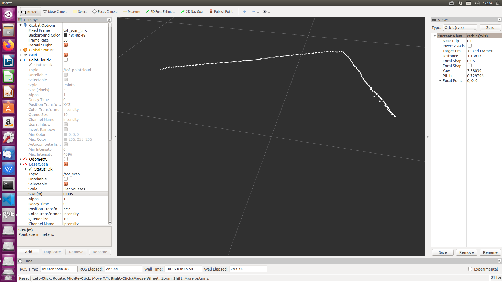

# ROS Wrapper for Sunny Optical Cleaner Devices
These are packages for using Sunny Optical cleaner02a (sunny_tof_node) with ROS.

## Installation Instructions

The following instructions are written for ROS Kinetic, on **Ubuntu 16.04**.

   ### Step 1: Install the ROS distribution
   - #### Install [ROS Kinetic](http://wiki.ros.org/kinetic/Installation/Ubuntu), on Ubuntu 16.04.

   ### Step 2: Install Sunny Optical cleaner02a (sunny_tof_node); ROS from Sources
   - Create a [catkin](http://wiki.ros.org/catkin#Installing_catkin) workspace
   ```bash
   mkdir -p ~/catkin_ws/src
   cd ~/catkin_ws/src/
   ```
   - Clone the latest Sunny Optical cleaner02a (sunny_tof_node); ROS into 'catkin_ws/src/'
   - Make sure all dependent packages are installed.

   ```bash
  catkin_init_workspace
  cd ..
  catkin_make clean
  catkin_make -DCATKIN_ENABLE_TESTING=False -DCMAKE_BUILD_TYPE=Release
  catkin_make install
  echo "source ~/catkin_ws/devel/setup.bash" >> ~/.bashrc
  source ~/.bashrc
  ```

## Usage Instructions

### Modify the USB permissions
Use `lsusb` to check the USB device number and replace {idVendor} and {idProduct} below.

```bash
cd /etc/udev/rules.d
sudo gedit 70-libusb.rules
```

Write the followings into the 70-libusb.rules:
SUBSYSTEM=="usb", ATTRS{idVendor}=="2207", ATTRS{idProduct}=="0017", MODE="0666"

```bash
sudo udevadm control --reload-rules
```

Remarks: Modify temporarily(Write 00*/* according to the `lsusb` display):

```bash
sudo chmod 777 /dev/bus/usb/00*/*
```

### Make the sunny_tof_node package

```bash
cd ~/catkin_ws
catkin_make_isolated
source src/sunny_tof_node/bin/setup.bash
```

### Start the sunny_tof_node
To start the sunny_tof_node node in ROS:

 - Clone the latest Sunny Optical cleaner02a's lib 'catkin_ws/src/sunny_tof_node/lib/*.so' into 'catkin_ws/src/sunny_tof_node/bin/lib'

```bash
rosrun sunny_tof_node sunny_tof_node
```

### Published Topics
After running the above command with cleaner02a attached, the following list of topics will be available (This is a partial list. For full one type `rostopic list`):
- /tof_pointcloud
- /tof_scan

### Launch parameters
The following parameters are available by the wrapper:
- **frame_id**: defines the frame_id all static transformations refers to.

### Point Cloud && Scan
Here is an example of how to open rviz to watch the pointcloud and scan. Open another terminal:
```bash
rviz
```



### About Frame ID
The wrapper publishes static transformations(TFs).
- tof_pointcloud_link
- tof_scan_link

## Known Issues
* This ROS node does not currently work with [ROS 2](https://github.com/ros2/ros2/wiki).
* This ROS node currently does not support running multiple cleaner02a at once. This will be addressed in a future update. 

## License
Copyright 2020 Sunny Optical Corporation

**Other names and brands may be claimed as the property of others*
